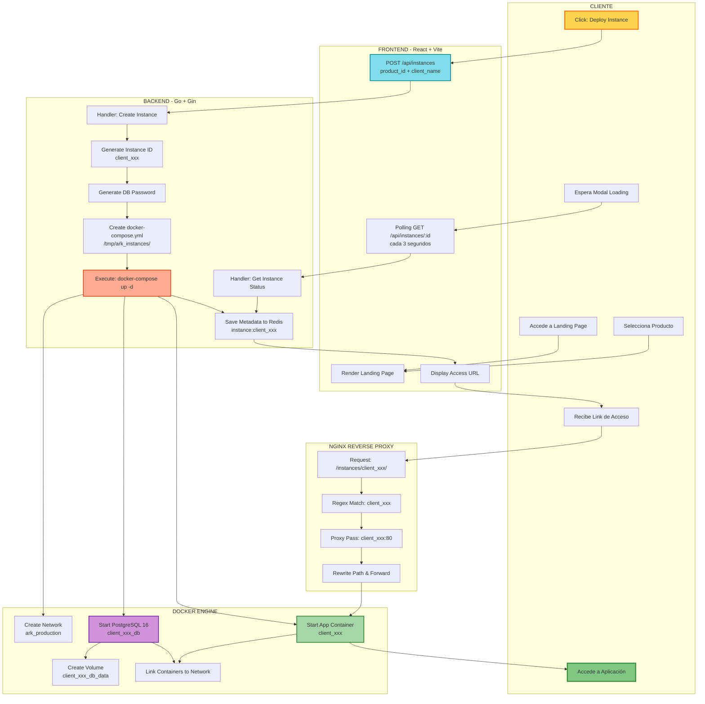
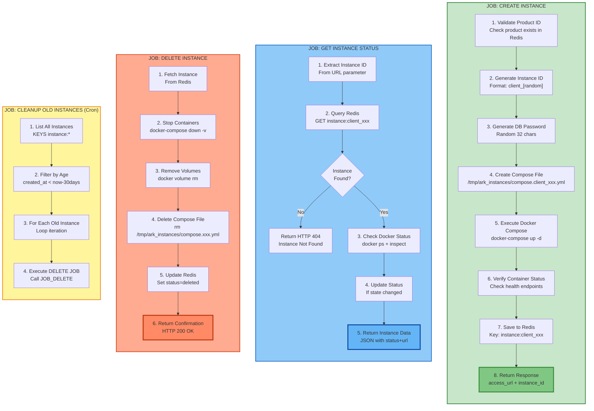

# Manual de Implementación: Sistema de Despliegue de Instancias con 1-Click

**Proyecto:** ARK_DEPLOY  
**Objetivo:** Transformar el sistema de "descarga de scripts" a despliegue automático con 1 click  
**Versión:** Simple - Sin Tailscale automático  
**Fecha:** Febrero 2026

---

## RESUMEN EJECUTIVO

Este manual describe cómo implementar un sistema donde:
- **Cliente**: Hace 1 click en un botón
- **Sistema**: Crea automáticamente contenedores Docker (app + PostgreSQL)
- **Cliente**: Recibe un link de acceso directo a su aplicación

**Nota importante:** El servidor ya debe estar conectado a Tailscale manualmente (configuración única)

---

## FLUJO DEL SISTEMA



---

## ARQUITECTURA DE COMPONENTES

```mermaid
graph LR
    subgraph ClientBrowser["CLIENT BROWSER"]
        CB1[Landing Page UI]
        CB2[Modal Deployment]
        CB3[Instance Access]
    end
    
    subgraph NginxLayer["NGINX - Port 3000"]
        N1[/ root path<br/>SPA Routing]
        N2[/api/*<br/>Backend Proxy]
        N3[/instances/:id/*<br/>Dynamic Proxy]
    end
    
    subgraph BackendAPI["BACKEND API - Go:5050"]
        API1[Products Handler<br/>CRUD Operations]
        API2[Instances Handler<br/>Create/Read/Delete]
        API3[Orchestrator<br/>Docker Management]
        API4[Redis Client<br/>State Storage]
    end
    
    subgraph DataLayer["DATA LAYER"]
        R1[(Redis<br/>Products & Instances)]
    end
    
    subgraph InstancesRuntime["CLIENT INSTANCES"]
        I1[client_001<br/>App:80]
        I2[client_001_db<br/>PostgreSQL:5432]
        I3[Volume: client_001_db_data]
        I4[client_002<br/>App:80]
        I5[client_002_db<br/>PostgreSQL:5432]
        I6[Volume: client_002_db_data]
    end
    
    subgraph DockerInfra["DOCKER INFRASTRUCTURE"]
        D1[Docker Socket<br/>/var/run/docker.sock]
        D2[Network<br/>ark_production]
        D3[Compose Files<br/>/tmp/ark_instances/]
    end
    
    CB1 --> N1
    CB2 --> N2
    CB3 --> N3
    
    N1 --> CB1
    N2 --> API1
    N2 --> API2
    N3 --> I1
    N3 --> I4
    
    API2 --> API3
    API3 --> D1
    API3 --> D3
    API1 --> API4
    API2 --> API4
    API4 --> R1
    
    D1 --> I1
    D1 --> I2
    D1 --> I4
    D1 --> I5
    
    I1 --> D2
    I2 --> D2
    I4 --> D2
    I5 --> D2
    
    I2 --> I3
    I5 --> I6
    
    style CB2 fill:#fff59d,stroke:#f57f17
    style API2 fill:#90caf9,stroke:#1565c0
    style API3 fill:#ffab91,stroke:#d84315
    style I1 fill:#a5d6a7,stroke:#388e3c
    style I4 fill:#a5d6a7,stroke:#388e3c
    style I2 fill:#ce93d8,stroke:#7b1fa2
    style I5 fill:#ce93d8,stroke:#7b1fa2
    style D1 fill:#ff8a65,stroke:#bf360c
    style D2 fill:#4fc3f7,stroke:#0277bd
```

---

## PASOS DE IMPLEMENTACIÓN

### PASO 1: Configurar Nginx para Routing Dinámico

**Objetivo:** Permitir que Nginx redirija `/instances/{id}/` a contenedores dinámicos

**Acciones:**
1. Abrir `frontend/nginx.conf`
2. Agregar nuevo bloque `location` con regex para capturar ID de instancia
3. Configurar `proxy_pass` dinámico usando variable capturada
4. Agregar rewrite para eliminar prefijo `/instances/{id}` antes de proxear
5. Configurar headers de proxy correctos

**Resultado esperado:**
- `/instances/client_abc123/` → `http://client_abc123:80/`
- Nginx puede resolver nombres de contenedores en red `ark_production`

---

### PASO 2: Actualizar Docker Compose para Orquestación

**Objetivo:** Dar al backend control sobre Docker para crear contenedores

**Acciones:**
1. Abrir `docker-compose.prod.yml`
2. En servicio `ark-deploy` agregar mount del socket Docker: `/var/run/docker.sock:/var/run/docker.sock`
3. Agregar volumen para almacenar archivos compose generados: `/tmp/ark_instances:/tmp/ark_instances`
4. Asegurar que la red `ark_production` tenga nombre fijo (no generado)
5. Crear directorio en host: `mkdir /tmp/ark_instances`

**Resultado esperado:**
- Backend puede ejecutar comandos `docker-compose` desde Go
- Archivos `.yml` temporales se guardan en `/tmp/ark_instances/`

---

### PASO 3: Crear Módulo Backend de Instancias (Go)

**Objetivo:** Lógica de orquestación para crear/gestionar instancias de clientes

**Acciones:**
1. Crear directorio `internal/instances/`
2. Crear `types.go`:
   - Struct `Instance` (id, product_id, status, access_url, db_name, db_password, created_at)
   - Struct `CreateInstanceRequest` (product_id, client_name)
   - Enum `InstanceStatus` (pending, running, failed, deleted)

3. Crear `orchestrator.go`:
   - Función `GenerateInstanceID()` → genera ID único `client_xxx`
   - Función `GeneratePassword()` → contraseña aleatoria para PostgreSQL
   - Función `CreateInstance()` → ejecuta todo el flujo
   - Función `GenerateComposeFile()` → crea docker-compose.yml dinámico
   - Función `StartContainers()` → ejecuta `docker-compose up -d`
   - Función `SaveInstance()` → guarda estado en Redis
   - Función `GetInstance()` → obtiene estado desde Redis
   - Función `ListInstances()` → lista todas las instancias
   - Función `DeleteInstance()` → ejecuta `docker-compose down -v` y limpia

4. Crear `handler.go`:
   - Endpoint `POST /api/instances` → crea nueva instancia
   - Endpoint `GET /api/instances/:id` → obtiene estado de instancia
   - Endpoint `GET /api/instances` → lista todas las instancias
   - Endpoint `DELETE /api/instances/:id` → elimina instancia

**Resultado esperado:**
- Backend puede recibir solicitud de creación
- Genera archivo `compose.client_xxx.yml` con PostgreSQL + App
- Ejecuta `docker-compose up -d` usando socket montado
- Guarda metadata en Redis
- Responde con `access_url` calculada

---

### PASO 4: Registrar Rutas de Instancias

**Objetivo:** Conectar handlers HTTP con lógica de orquestación

**Acciones:**
1. Abrir `internal/server/routes.go`
2. Importar paquete `internal/instances`
3. Crear instancia de `Orchestrator` pasando `redisClient` y `config.BaseURL`
4. Crear instancia de `Handler` con orchestrator
5. Registrar 4 rutas:
   - `router.POST("/instances", instancesHandler.Create)`
   - `router.GET("/instances", instancesHandler.List)`
   - `router.GET("/instances/:id", instancesHandler.Get)`
   - `router.DELETE("/instances/:id", instancesHandler.Delete)`

**Resultado esperado:**
- Endpoints REST disponibles en `/api/instances`

---

### PASO 5: Agregar Variable de Configuración BASE_URL

**Objetivo:** Backend necesita saber la URL pública para generar links de acceso

**Acciones:**
1. Abrir `.env.prod`
2. Agregar línea: `BASE_URL=http://100.103.47.3:3000`
3. Abrir `internal/config/config.go`
4. Agregar campo `BaseURL string` al struct `Config`
5. En función `Load()` leer variable con `getEnv("BASE_URL", "http://localhost:3000")`

**Resultado esperado:**
- Backend puede generar URLs como `http://100.103.47.3:3000/instances/client_xxx/`

---

### PASO 6: Modificar Frontend para Flujo de Despliegue

**Objetivo:** Cambiar de "descargar script" a "crear instancia y mostrar link"

**Acciones:**
1. Abrir `frontend/src/LandingPage.jsx`
2. Modificar función `handleInstall()`:
   - Eliminar llamada a `generateAuthKey()`
   - Eliminar llamada a `generateInstallScript()`
   - Eliminar llamada a `downloadScript()`
   - Agregar llamada `POST /api/instances` con `{ product_id, client_name }`
   - Agregar loop de polling cada 3 segundos a `GET /api/instances/{id}`
   - Cuando `status === 'running'`, pasar a step READY

3. Actualizar constante `STEP_MESSAGES`:
   - Cambiar mensajes a "Creando contenedores Docker...", "Configurando base de datos PostgreSQL..."

4. Modificar componente `DeploymentReady`:
   - Eliminar botón "Download Script"
   - Eliminar botón "Copy to Clipboard"
   - Agregar botón único: "Acceder a mi Aplicación" con `href={deploymentData.accessUrl}`

**Resultado esperado:**
- Usuario hace click → modal con spinner → link aparece → usuario accede

---

### PASO 7: Rebuild y Deploy

**Objetivo:** Aplicar todos los cambios en producción

**Acciones:**
1. Backend:
   - `go mod tidy`
   - `docker build -t ghcr.io/raztreuzz/ark_deploy-backend:prod .`
   - `docker push ghcr.io/raztreuzz/ark_deploy-backend:prod`

2. Frontend:
   - `cd frontend`
   - `npm run build`
   - `docker build -t ghcr.io/raztreuzz/ark_deploy-frontend:prod .`
   - `docker push ghcr.io/raztreuzz/ark_deploy-frontend:prod`

3. Deploy:
   - Ejecutar job Jenkins: `ARK_DEMO_DEPLOY`
   - O manualmente: `docker-compose -f docker-compose.prod.yml up -d --pull always`

**Resultado esperado:**
- Servicios actualizados corriendo en `100.103.47.3:3000`

---

### PASO 8: Testing End-to-End

**Objetivo:** Verificar que el flujo completo funciona

**Acciones:**
1. Acceder a `http://100.103.47.3:3000` desde navegador con Tailscale
2. Crear un producto de prueba desde `/admin` (si no existe)
3. Volver a landing page
4. Hacer click en botón "Deploy Instance" de un producto
5. Observar spinner de carga
6. Esperar 30-60 segundos
7. Verificar que aparece link de acceso
8. Hacer click en link
9. Verificar que aplicación carga correctamente

**Comandos de verificación:**
```bash
# Ver contenedores creados
docker ps | grep client_

# Ver volúmenes
docker volume ls | grep client_

# Ver logs
docker logs client_xxx

# Ver estado en Redis
redis-cli
> KEYS instance:*
> GET instance:client_xxx
```

**Resultado esperado:**
- Aplicación funcional accesible en `/instances/client_xxx/`
- Base de datos PostgreSQL aislada con datos persistentes

---

## ESTRUCTURA DE JOBS DEL SISTEMA



---

## ESTRUCTURA DE ARCHIVOS COMPOSE GENERADOS

**Ubicación:** `/tmp/ark_instances/compose.client_xxx.yml`

**Contenido dinámico por instancia:**
- Nombre de servicio app: `client_{id}`
- Nombre de servicio db: `client_{id}_db`
- Nombre de volumen: `client_{id}_db_data`
- Variables de entorno únicas:
  - `DB_NAME=client_{id}_db`
  - `DB_USER=postgres`
  - `DB_PASSWORD={generado_aleatorio}`
  - `DB_HOST=client_{id}_db`
- Todos los servicios en red: `ark_production` (external)
- Puerto expuesto: App en puerto 80 (interno, no publicado fuera)

---

## CHECKLIST DE IMPLEMENTACIÓN

### Infraestructura
- [ ] Nginx config con regex `location ~ ^/instances/([a-z0-9_-]+)(/.*)?$`
- [ ] Docker socket montado en backend
- [ ] Directorio `/tmp/ark_instances` creado
- [ ] Red `ark_production` creada como externa

### Backend (Go)
- [ ] Módulo `internal/instances/` creado
- [ ] Archivos `types.go`, `orchestrator.go`, `handler.go` implementados
- [ ] Rutas registradas en `routes.go`
- [ ] Variable `BASE_URL` en config
- [ ] Dependencia Redis en `go.mod`

### Frontend (React)
- [ ] `handleInstall()` llama a POST `/api/instances`
- [ ] Polling cada 3 segundos implementado
- [ ] Modal `DeploymentReady` muestra link directo
- [ ] Mensajes actualizados (sin mencionar Tailscale/scripts)

### Testing
- [ ] Crear instancia manual con curl funciona
- [ ] Acceder a instancia via nginx funciona
- [ ] Eliminar instancia limpia todos los recursos
- [ ] Test desde UI: botón → loading → link → aplicación

---

## TROUBLESHOOTING COMÚN

| Problema | Causa Probable | Solución |
|----------|---------------|----------|
| `Cannot connect to Docker daemon` | Socket no montado | Verificar volume en docker-compose.prod.yml |
| `network ark_production not found` | Red no creada | `docker network create ark_production` |
| `502 Bad Gateway` en `/instances/xxx/` | Contenedor no en red correcta | Verificar `docker inspect client_xxx` NetworkMode |
| Timeout en polling frontend | Contenedores tardan > 3 min | Aumentar `maxAttempts` o revisar logs Docker |
| `pg_isready` healthcheck falla | PostgreSQL no inicializa | Aumentar `start_period: 30s` en compose |

---

## PRÓXIMOS PASOS

### Mejoras Fase 2
- [ ] Sistema de queue (RabbitMQ/Redis Streams) para despliegues async
- [ ] Worker pool para múltiples despliegues concurrentes
- [ ] Panel de admin para ver todas las instancias activas
- [ ] Métricas de recursos por instancia (CPU, RAM, Storage)

### Mejoras Fase 3
- [ ] Backup automático de bases de datos cada 24h
- [ ] SSL/TLS con Let's Encrypt automático
- [ ] Subdominios dinámicos: `cliente-123.ark.network`
- [ ] CDN para assets estáticos
- [ ] Límites de recursos por instancia (CPU, RAM)

---

**Autor:** ARK_DEPLOY Team  
**Última actualización:** Febrero 2026  
**Versión:** 1.0 (Simple)
